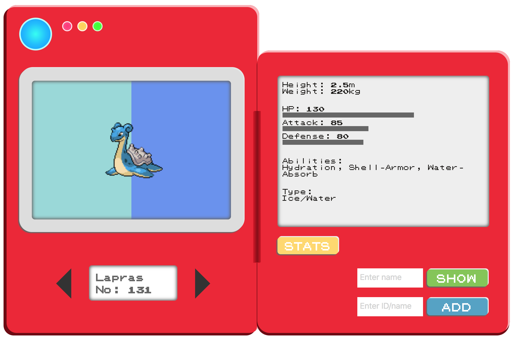
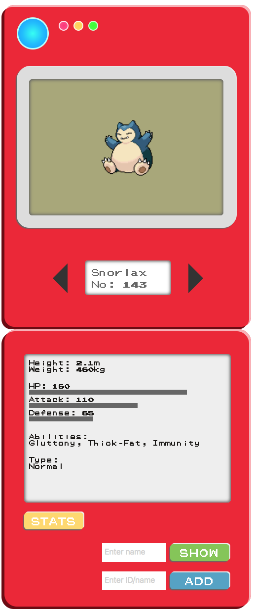

# mokaydex
## Pokédex showcasing three of my favorite Pokémon

## Utilizes:
* Pokémon API
* AJAX
* jQuery
* Materialize
* SASS

Desktop view:

Mobile view:

## Features:
* "Add" button that generates a new Pokémon by making an AJAX call to the API
* "Stats" button that toggles showing additional info
* "Show" button that retrieves a Pokémon from the Pokédex by name
* Materialize Preloader that improves the UX while AJAX calls are being made
* Image container background color(s) that change with different Pokémon type(s)
* Horizontal bar graph in which each width is dependent on its corresponding stat value
* Mobile responsive
* Retro look inspired by the Kanto Pokédex

## Acknowledgements
* [Pokémon GAME BOY Font](https://github.com/Superpencil/pokemon-font/) by Superpencil
* Inspiration: [Pokedex.org](https://www.pokedex.org/)
